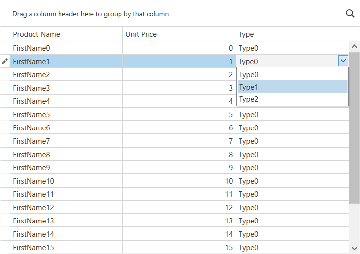

<!-- default badges list -->

<!-- default badges end -->

# WPF Data Grid - Assign a ComboBox Editor to a Column

This example shows how to assign the combo box and spin editors to grid columns.

## Files to Look At

* [MainWindow.xaml](./CS/DXGrid_AssignComboBoxToColumn/MainWindow.xaml) (VB: [MainWindow.xaml](./VB/DXGrid_AssignComboBoxToColumn/MainWindow.xaml))
* [MainWindow.xaml.cs](./CS/DXGrid_AssignComboBoxToColumn/MainWindow.xaml.cs) (VB: [MainWindow.xaml.vb](./VB/DXGrid_AssignComboBoxToColumn/MainWindow.xaml.vb))

## Documentation

* [Assign Editors to Cells](https://docs.devexpress.com/WPF/401011/controls-and-libraries/data-grid/data-editing-and-validation/modify-cell-values/assign-an-editor-to-a-cell)
* [Edit Cell Values in UI](https://docs.devexpress.com/WPF/6606/controls-and-libraries/data-grid/data-editing-and-validation/modify-cell-values/inplace-editors)
<!-- feedback -->
## Does this example address your development requirements/objectives?

 

(you will be redirected to DevExpress.com to submit your response)
<!-- feedback end -->
